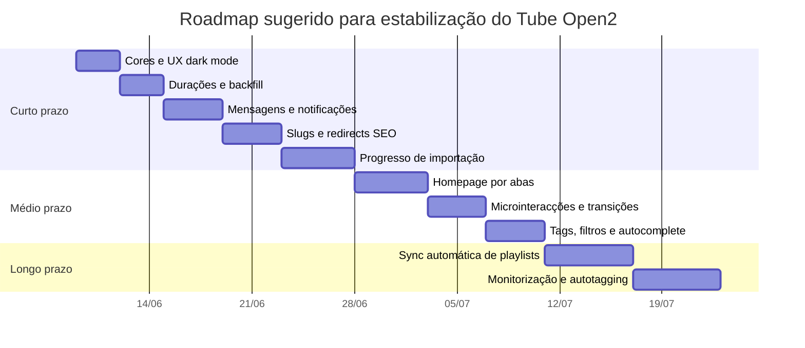
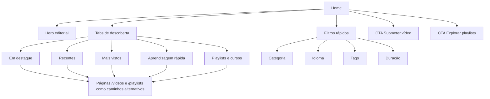
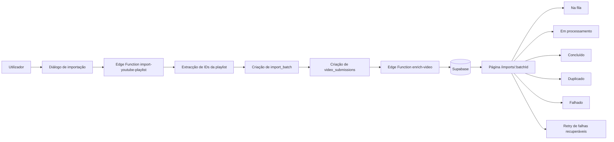
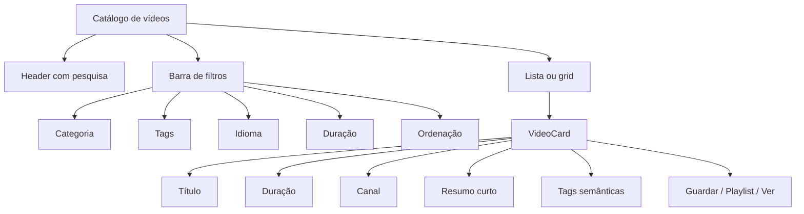

# Tube Open2 melhoria e estabilização

## Resumo executivo

O Tube Open2 já não está numa fase “embrionária”: o repositório mostra uma base técnica relativamente sólida, com React 18, TypeScript, Vite, Tailwind, React Query, React Router, Supabase, Edge Functions e internacionalização; além disso, a própria documentação interna do projecto descreve uma arquitectura com rotas lazy, pipeline assíncrona de submissão/importação e views de exibição para vídeos e playlists. citeturn15view0turn13view0

O problema principal, nesta versão, não é a ausência de fundações, mas sim a **falta de coesão entre UX, dados e operações**. Há sinais claros disso no código: a homepage compõe vários rails a partir do mesmo “pool” de vídeos, o que tende a repetir conteúdo; as durações dependem de `duration_seconds`, mas o badge desaparece quando esse campo falta e o formatador actual só trata `mm:ss`, o que degrada a leitura de vídeos longos; e a importação de playlists fecha-se num diálogo com toasts, sem uma página de progresso por lote, apesar de a app já usar `video_submissions` como fonte de verdade para estados assíncronos. citeturn22view6turn26view0turn28view3turn36view3turn36view4turn32view0

Também há um ponto importante de diagnóstico: o menu móvel responsivo, o splash screen e as transições de entrada **já existem** no repositório. Ou seja, a sensação de que “faltam” estas peças no produto actual aponta menos para ausência de implementação e mais para **execução insuficiente, cobertura incompleta no site em produção ou microinteracções ainda pouco polidas**. O `Header` usa `Sheet` para navegação móvel, o `SplashScreen` está implementado com temporizadores e respeito por `prefers-reduced-motion`, e o `PageTransition` aplica a animação `animate-page-enter`. citeturn24view3turn24view4turn41view0turn22view5turn22view4turn24view0

A prioridade mais rentável, nas próximas duas a três semanas, é concentrar trabalho em seis frentes: **auditoria de cores e hierarquia visual**, **correcção e preenchimento de durações**, **página de progresso de importação**, **refactor de slugs para SEO**, **smoke audit dos sistemas de mensagens/notificações**, e **revisão de segurança Supabase com RLS, Storage e backups/PITR**. Estas medidas alinham o produto com as boas práticas oficiais da Supabase para defesa em profundidade, autenticação em Edge Functions e backups, e com as recomendações da Google para URLs descritivos. citeturn47search0turn47search1turn47search2turn47search3turn47search16

Assumo, para as estimativas de esforço abaixo, **um programador full-stack familiarizado com o projecto mais apoio de IA**. Onde existirem incertezas, assinalo-as explicitamente.

## Diagnóstico do estado actual

### Leitura global do produto

A documentação do próprio projecto descreve um produto ambicioso: homepage editorial, catálogo de vídeos, playlists, perfis, favoritos, mensagens, notificações, portal editorial, submissão assíncrona com `video_submissions`, enriquecimento por IA e views públicas de exibição. No entanto, o repositório público também mostra cinco issues abertas focadas sobretudo em follow de playlists e workflows editoriais, o que sugere que parte da atenção de produto já estava a migrar para features colaborativas antes de fechar completamente a camada base de UX, observabilidade e estabilização. citeturn15view0turn16view0

### Matriz de problemas actuais com evidência

| Área | Evidência técnica | Leitura analítica |
|---|---|---|
| Sistema visual | O tema é baseado em tokens HSL (`background`, `foreground`, `primary`, `muted`, `accent`, etc.), com `darkMode: ["class"]`. Ao mesmo tempo, **todos** os `borderRadius` configurados no Tailwind estão a `0px`. citeturn49view0 | A base é boa para corrigir cores rapidamente, mas o sistema actual tende para um look demasiado duro e “cortante” em cartões, inputs e CTAs. Um pequeno ajuste de raios e superfícies melhoraria imediatamente o conforto visual, sobretudo em dark mode. |
| Homepage | A homepage cria vários rails (`trendingNow`, `freshDrops`, `mostViewed`, `communityPicks`, `withSummaries`, `quickLessons`) a partir do mesmo `allRailsPool`, alternando secções `dark` e `light`. citeturn22view6turn20view3 | Isto aumenta a sensação de volume, mas também cria risco elevado de repetição de conteúdo entre secções e de “home longa demais” com pouca novidade percebida. |
| Responsividade e navegação móvel | O `Header` já usa `Sheet` e um botão `Menu`; a navegação móvel tem pesquisa, atalhos, contadores de mensagens/notificações e CTA para submissão. citeturn24view3turn24view4turn41view0 | O hamburger responsivo não é uma lacuna estrutural. O trabalho correcto aqui é de **polimento**: foco inicial, teclado, estados activos, fecho previsível, densidade visual e quick actions. |
| Tags e descoberta | Os `semantic_tags` no `VideoCard` são mostrados apenas em `variant === 'default'`, e mesmo aí o contentor usa `hidden sm:flex`. citeturn24view8 | Em ecrãs pequenos, a descoberta semântica por tags desaparece, o que prejudica exactamente a navegação por temas/categorias onde o mobile mais precisa de pistas curtas. |
| Durações dos vídeos | O `VideoDurationBadge` existe, mas devolve `null` quando `durationSeconds` falta ou é `<= 0`. O formatador `formatDuration` só produz `mins:secs`; vídeos acima de uma hora apareceriam como `125:03`, por exemplo, em vez de `2:05:03`. Há ainda um script de backfill que procura vídeos com `duration_seconds` nulo ou `<=0` e os actualiza. citeturn26view0turn28view3turn28view0 | O problema “vídeos sem marcação de tempo” não é apenas visual: é também de ingestão e de formatação. A correcção certa junta três camadas: pipeline, backfill e UI. |
| Enriquecimento e importação | A função `enrich-video` pode devolver `durationSeconds: null` quando a recolha pública de metadados falha. A importação de playlists extrai IDs da página HTML do YouTube, corta a lista por `max_videos`, e o diálogo da UI chama `import-youtube-playlist`, depois `enrich-video`, mostra toast e fecha. No frontend, `max_videos` está hardcoded para `50`. citeturn35view6turn35view0turn35view2turn36view3turn36view4 | A importação actual é funcional, mas frágil e pouco observável: depende de HTML externo, limita-se a 50 vídeos por chamada e não oferece um ecrã de progresso por lote. |
| Slugs e rotas SEO | `getVideoRoute` já devolve `/videos/${video.slug || video.id}`; a API já tenta lookup por `slug`; mas a rota inteligente `SmartSlugRoute` só intercepta slugs de 11 caracteres que pareçam YouTube IDs. A Google recomenda URLs descritivos em vez de IDs pouco legíveis. citeturn29view0turn30view1turn28view7turn47search3 | O projecto está “a meio caminho”: já prevê `slug`, mas ainda carrega legado orientado a ID. Vale a pena concluir este caminho agora, antes de acumular links antigos. |
| Mensagens | A página `/messages` existe, usa hooks de inbox, conversa, envio e marcação como lida; os hooks usam realtime sobre `direct_messages`; e a API chama RPCs “secure” como `list_inbox_conversations_secure`, `get_conversation_by_username_secure` e `send_direct_message_by_username_secure`. Ao mesmo tempo, o resumo de schema em `CODEBASE.md` não enumera `direct_messages` nem `notifications`. citeturn22view0turn22view1turn44view0turn44view1turn46view1turn46view2turn15view0 | A UI de mensagens não está ausente. O cenário mais provável é **desalinhamento entre frontend e backend**: migrations em falta, RPCs não aplicadas em produção, RLS inadequada, ou documentação/schema desactualizados. |
| Splash e transições | O `SplashScreen` existe com controlo por sessão e timers; `PageTransition` aplica `animate-page-enter`; o CSS também desactiva estas animações quando o utilizador prefere menos movimento. A MDN recomenda respeitar `prefers-reduced-motion`. citeturn22view5turn22view4turn24view0turn24view1turn48search1 | A base está certa, mas ainda é uma base. O próximo passo não é “inventar” transições; é dar-lhes melhor acabamento e consistência. |
| Segurança Supabase | As instruções do repositório reforçam que a service role deve ficar só no backend e que as Edge Functions devem validar método, CORS, auth e JSON. A `.env.example` separa claramente chaves públicas e `SUPABASE_SERVICE_ROLE_KEY`. A documentação da Supabase recomenda RLS com menor privilégio possível, Storage alinhado com RLS e backups/PITR para recuperação. citeturn32view0turn33view5turn33view6turn47search0turn47search1turn47search4turn47search16 | A intenção de segurança é boa, mas falta transformar intenção em **auditoria verificável**: políticas RLS reais, testes negativos, Storage buckets, secretação, restore drill e inventário de funções/RPCs. |

### O que já existe e deve ser aproveitado

Há quatro blocos que convém **não reescrever do zero**. Primeiro, a navegação móvel já foi resolvida tecnicamente com `Sheet` + `MobileNav`. Segundo, o projecto já tem mecanismo de splash e page-enter, com respeito por utilizadores que preferem menos movimento. Terceiro, a infraestrutura de mensagens/notificações já está desenhada com hooks, realtime e RPCs sécure. Quarto, a importação assíncrona já usa `video_submissions` como contrato de estado. A estratégia mais eficiente é aproveitar estas bases e completar o que falta à volta delas. citeturn24view3turn41view0turn22view5turn24view1turn44view0turn46view1turn32view0

### Riscos específicos que merecem atenção imediata

O risco mais óbvio de UX é a **repetição editorial da homepage**, porque várias secções reutilizam o mesmo conjunto base de vídeos. O risco mais óbvio de dados é a **incompletude de `duration_seconds`**, agravada pelo formatador actual que nem sequer trata horas. O risco mais óbvio de operação é a **importação por scraping HTML do YouTube com limite hardcoded de 50 vídeos**, sem um dashboard de execução. E o risco mais óbvio de segurança é a clássica zona cinzenta de projectos Supabase maduros: **RLS aparentemente pensada, mas nem sempre validada por testes de fuga de dados e restore drills**. citeturn22view6turn28view3turn35view0turn35view2turn36view3turn47search0turn47search1

## Roadmap priorizado

### Backlog recomendado por impacto, esforço e risco

| Horizonte | Tarefa | Impacto | Esforço | Risco | Justificação |
|---|---|---:|---:|---:|---|
| Curto prazo | Auditoria de cores, contraste e hierarquia visual em light/dark | Muito alto | 8–14 h | Baixo | O design system já é tokenizado e suporta dark mode, mas a agressividade visual do sistema actual pede afinação rápida. citeturn49view0 |
| Curto prazo | Correcção de `formatDuration` para suportar horas e revisão dos badges | Muito alto | 3–6 h | Baixo | O bug de formatação é objectivo e afecta a legibilidade de vídeos longos. citeturn28view3turn26view0 |
| Curto prazo | Backfill controlado de `duration_seconds` e retry na pipeline | Muito alto | 6–12 h | Médio | O sistema já prevê backfill e a pipeline pode deixar a duração nula em falha de metadata pública. citeturn28view0turn35view6 |
| Curto prazo | Página de progresso de importação por lote | Muito alto | 16–28 h | Médio | A importação actual usa toasts e fecha o diálogo; falta observabilidade para o utilizador. citeturn36view3turn36view4turn32view0 |
| Curto prazo | Smoke audit de mensagens e notificações em produção | Muito alto | 10–18 h | Médio/alto | O frontend existe; a falha provável está em RPCs, migrations ou RLS. citeturn22view0turn44view1turn46view1turn15view0 |
| Curto prazo | Refactor de slugs de vídeos e redirects SEO | Alto | 12–20 h | Médio | O produto já prevê `slug`, mas a implementação ainda vive a meio caminho entre IDs e slugs. citeturn29view0turn30view1turn28view7turn47search3 |
| Curto prazo | Foco inicial em diálogos/formulários e revisão de teclado | Alto | 6–10 h | Baixo | O menu móvel e o diálogo de importação não mostram evidência de autofocus contextual programático. A MDN recomenda usar foco com cuidado, especialmente em diálogo. citeturn36view6turn48search0turn48search16 |
| Médio prazo | Reorganização da homepage por “abas/slots” em vez de rails cumulativos | Alto | 12–24 h | Médio | Reduz repetição de conteúdo e encurta o scroll. A actual composição tende a reciclar o mesmo pool. citeturn22view6 |
| Médio prazo | Microinteracções suaves e animações acessíveis | Médio/alto | 10–18 h | Baixo/médio | Já existe suporte a `prefers-reduced-motion`; falta transformar isso em linguagem de interface consistente. citeturn24view1turn48search1 |
| Médio prazo | Tags/categorias com combobox e autocomplete | Alto | 12–20 h | Médio | Hoje os `semantic_tags` até desaparecem em mobile, o que torna a navegação semântica mais pobre. citeturn24view8 |
| Médio prazo | Revisão de secções de vídeo e carrossel com navegação acessível | Médio/alto | 12–24 h | Médio | O web.dev recomenda gestos mobile e caminhos alternativos de navegação para carrosséis. citeturn48search2 |
| Longo prazo | Importação automática de playlists e reprocessamento agendado | Alto | 24–40 h | Alto | Faz sentido depois de existir batch tracking estável e observabilidade. citeturn32view0turn35view0 |
| Longo prazo | Autotagging, enriquecimento incremental e monitorização de jobs | Alto | 24–48 h | Alto | Amplia descoberta e reduz trabalho editorial, mas depende primeiro de estabilidade na pipeline. citeturn15view0turn35view6 |

### Sequência recomendada de execução



### Sugestões adicionais de alto valor

Há três melhorias “automáticas” que eu colocaria logo no radar do produto. A primeira é um **job recorrente de backfill** de metadados frágeis, começando por duração e, opcionalmente, transcript status. A segunda é um **sistema de reimportação inteligente de playlists**, que só tenta novamente vídeos com estado recuperável ou metadata incompleta. A terceira é uma **camada de monitorização de jobs** com logs legíveis para importações, enrichments e falhas externas. Tudo isto encaixa bem na arquitectura actual, que já usa `video_submissions`, Edge Functions e views de exibição. citeturn15view0turn35view6turn32view0

## Sequência de prompts

### Prompt inicial de cores e hierarquia visual

Este é o prompt de arranque mais certo, porque ataca a perceção imediata de qualidade e aproveita o facto de o projecto já usar tokens de cor HSL e dark mode por classe. citeturn49view0

```text
Considere ajustar a cor de componentes como as tags em cinza, a escolha de cores de fundo das secções da homepage em modo dark e outros ajustes finos de cores, UI e UX que possam comprometer a experiência de utilização da plataforma pelos utilizadores.

Contexto do projecto:
- Stack: React + TypeScript + Vite + Tailwind + shadcn/ui.
- O sistema de tema já usa tokens HSL e dark mode por classe.
- A homepage alterna secções light/dark e precisa de melhor hierarquia visual.
- O objectivo é aumentar contraste, clareza, sensação premium e legibilidade sem quebrar a identidade da marca.

Tarefas:
1) Auditar todos os tokens de surface, muted, accent, card, border e semantic tags.
2) Corrigir contrastes insuficientes em modo dark.
3) Rever badges, chips, tags e estados hover/focus/active.
4) Suavizar a interface com uma escala pequena de arredondamento em CTAs, inputs, dropdowns e cards prioritários.
5) Melhorar CTA principal/secundário com estados mais nítidos.
6) Entregar diff dos ficheiros alterados, racional de design e screenshots comparativas antes/depois.

Restrições:
- Respeitar prefers-reduced-motion.
- Não introduzir regressões visuais em mobile.
- Preservar o sistema de design baseado em tokens, sem hardcodes desnecessários.
```

### Prompt de durações e timestamps

O repositório já mostra que o badge existe, mas falta completar dados e formatar correctamente durações longas. citeturn26view0turn28view3turn28view0

```text
Audita e corrige todo o fluxo de durações dos vídeos no Tube Open2.

O que já existe:
- Há um VideoDurationBadge que renderiza a duração apenas se duration_seconds existir.
- O formatador actual só suporta mm:ss.
- Existe um script de backfill para duration_seconds.
- A pipeline enrich-video pode deixar durationSeconds a null.

Objectivos:
1) Corrigir formatDuration para suportar h:mm:ss.
2) Garantir que cards, listas, rails e páginas de detalhe mostram duração consistente.
3) Identificar todos os pontos onde duration_seconds pode ficar vazio.
4) Melhorar o script de backfill, com dry-run, relatório final e opção de retry seguro.
5) Adicionar testes unitários para 59s, 5m12s, 1h05m03s e valores nulos.
6) Entregar plano de migração zero-downtime.

Quero:
- Diff por ficheiro.
- Snippets de teste.
- Scripts npm/pnpm úteis.
- Checklist de QA para desktop e mobile.
```

### Prompt de mensagens directas

O frontend e a camada de hooks já existem; o prompt certo aqui é de **auditoria e reparação backend-first**, não de reescrever UI. citeturn22view0turn44view1turn46view1turn46view2

```text
Faz uma auditoria completa ao sistema de mensagens directas do Tube Open2 e corrige o que impedir o seu funcionamento em produção.

Contexto:
- A página /messages já existe.
- O frontend usa realtime sobre direct_messages.
- O envio e leitura dependem de RPCs secure no Supabase.
- O problema actual pode estar em migrations, RLS, RPCs, views, grants ou contratos desfasados.

Tarefas:
1) Mapear todas as dependências do sistema de mensagens: tabelas, RPCs, policies, subscriptions e tipos.
2) Validar se as migrations necessárias existem e se o frontend corresponde ao schema actual.
3) Rever RLS para direct_messages.
4) Rever RPCs list_inbox_conversations_secure, get_conversation_by_username_secure, send_direct_message_by_username_secure, mark_conversation_as_read_by_username_secure e get_unread_messages_count_secure.
5) Criar testes de integração e uma checklist de verificação manual.
6) Se necessário, propor migração incremental e backfill.

Entrega:
- Diagnóstico por causa-raiz.
- SQL de correcção.
- Ajustes frontend mínimos.
- Passo-a-passo para validar em staging e produção.
```

### Prompt de splash e transições

O código já tem uma base, por isso este prompt deve pedir **evolução**, não reconstrução de raíz. citeturn22view4turn22view5turn24view0

```text
Aprimora a animação de abertura e as transições entre páginas do Tube Open2 com foco em sofisticação, suavidade e consistência.

Contexto:
- Já existe SplashScreen com controle por sessão.
- Já existe PageTransition com animate-page-enter.
- Falta transformar estas bases em experiência premium e consistente.

Objectivos:
1) Redesenhar a intro para durar menos tempo, com mais impacto visual e menos atrito.
2) Harmonizar a abertura do site com as transições internas.
3) Aplicar transições subtis entre páginas principais.
4) Garantir acessibilidade total com prefers-reduced-motion.
5) Evitar atrasos perceptíveis no first contentful render.

Quero:
- Implementação preferencialmente CSS-first.
- Alternativa opcional com framer-motion se a versão CSS não for suficiente.
- Resumo de trade-offs.
- Código final pronto a integrar.
```

### Prompt de dinamismo e microinteracções

```text
Torna o Tube Open2 mais dinâmico sem cair em excesso de animação.

Prioridades:
- Movimento horizontal suave e acessível nos rails/carrosséis da homepage.
- CTAs com microinteracções claras.
- Foco inicial contextual em formulários e diálogos.
- Botões, tabs e filtros com hover/focus states mais legíveis.
- Estados de loading/skeleton mais elegantes.
- Tudo deve pausar ou reduzir com prefers-reduced-motion.

Quero que implementes:
1) autoplay opcional e muito lento nos rails, com pausa em hover/focus/toque;
2) destaque visual equilibrado para CTA primário/secundário;
3) autofocus contextual seguro em formulários e diálogos;
4) melhorias de percepção de resposta em filtros, pesquisa e navegação.

Entrega:
- lista de componentes alterados;
- explicação das escolhas;
- teste manual guiado.
```

### Prompt de slugs e SEO

A implementação actual já admite `slug` na rota; o prompt deve fechar este caminho e não inventar outro contrato à margem. citeturn29view0turn30view1turn28view7turn47search3turn47search19

```text
Refatora o sistema de slugs dos vídeos no Tube Open2 para usar títulos descritivos, melhorando SEO e usabilidade, sem quebrar links existentes.

Contexto:
- O projecto já suporta slug em getVideoRoute e em parte da API.
- A Google recomenda URLs descritivos e títulos de página claros.
- Há legado centrado em IDs.

Tarefas:
1) Definir um contrato final para slugs únicos, estáveis e legíveis.
2) Criar ou actualizar migration para popular/corrigir slugs dos vídeos existentes.
3) Implementar redirects dos URLs antigos para os novos.
4) Rever canonicals, title, meta e og tags quando aplicável.
5) Garantir lookup tanto por slug como por rota legada durante a transição.
6) Entregar plano de rollout seguro.

Quero:
- estratégia de colisão;
- estratégia de redirect;
- testes;
- impacto em SEO explicado.
```

### Prompt de página de progresso de importação

Esta é uma das lacunas mais claras do produto actual. citeturn36view3turn36view4turn32view0

```text
Cria no Tube Open2 uma página de progresso de importação de vídeos por playlist, para que o utilizador acompanhe o estado do lote em tempo real.

Contexto:
- A importação usa import-youtube-playlist.
- Depois disso o frontend chama enrich-video por submissão.
- Hoje a UI resume tudo num toast e fecha o diálogo.
- video_submissions já é a fonte de verdade do estado assíncrono.

Quero:
1) um identificador de lote de importação;
2) uma rota pública/autenticada para acompanhar o lote;
3) estados visuais: na fila, em processamento, concluído, duplicado, falhado, recuperável;
4) totais por estado;
5) lista paginada dos vídeos/submissões;
6) links para o vídeo final quando existir;
7) possibilidade de retry apenas para falhas recuperáveis.

Entrega:
- proposta de schema e migrações;
- UI completa;
- hooks React Query;
- integração com realtime ou polling;
- testes e guia de QA.
```

### Prompt de segurança e QA

```text
Executa uma revisão de segurança e estabilização do Tube Open2 considerando todo o contexto Supabase.

Quero uma auditoria com:
1) inventário de tabelas, views, RPCs, buckets e Edge Functions;
2) revisão de RLS por tabela sensível;
3) revisão de autenticação e autorização nas Edge Functions;
4) validação de CORS, method guard, payload validation e rate limit;
5) revisão de secrets, service role e ambientes;
6) plano de backups, PITR e testes de restore;
7) checklist de testes unitários, integração, E2E, acessibilidade e responsividade;
8) plano de observabilidade e alertas.

Entrega:
- relatório objectivo por risco;
- SQL e código recomendados;
- severidade por item;
- passos exactos para remediar;
- critérios de pronto para produção.
```

## Especificações técnicas e snippets

### Correcção de durações e horas

O bug mais objectivo da camada de UX está em `formatDuration`, que neste momento só devolve `mins:secs`. Para um catálogo com playlists de estudo, isto é insuficiente. citeturn28view3

```ts
// src/shared/lib/format.ts
export function formatDuration(seconds?: number | null): string {
  if (!seconds || seconds <= 0) return '';

  const hours = Math.floor(seconds / 3600);
  const minutes = Math.floor((seconds % 3600) / 60);
  const secs = seconds % 60;

  if (hours > 0) {
    return `${hours}:${String(minutes).padStart(2, '0')}:${String(secs).padStart(2, '0')}`;
  }

  return `${minutes}:${String(secs).padStart(2, '0')}`;
}
```

Se quiseres manter um placeholder visível quando a duração ainda não estiver pronta, em vez de esconder completamente o badge, podes adoptar um estado intermédio:

```tsx
// src/components/video/VideoDurationBadge.tsx
export function VideoDurationBadge({
  durationSeconds,
  className,
  variant = 'overlay',
}: VideoDurationBadgeProps) {
  const { t } = useTranslation();

  if (durationSeconds == null) {
    return (
      <span
        aria-label={t('video.durationPending')}
        className={cn(
          'inline-flex shrink-0 items-center justify-center tabular-nums opacity-70',
          variant === 'overlay' &&
            'absolute bottom-2 right-2 z-20 min-w-12 bg-black/60 px-2 py-1 text-[0.65rem] font-bold leading-none text-white shadow-sm',
          className,
        )}
      >
        …
      </span>
    );
  }

  if (durationSeconds <= 0) return null;

  const duration = formatDuration(durationSeconds);

  return (
    <span
      aria-label={t('video.durationLabel', { duration })}
      className={cn(
        'inline-flex shrink-0 items-center justify-center tabular-nums',
        variant === 'overlay' &&
          'absolute bottom-2 right-2 z-20 min-w-12 bg-black/85 px-2 py-1 text-[0.65rem] font-bold leading-none text-white shadow-sm',
        variant === 'inline' && 'font-medium',
        className,
      )}
    >
      {duration}
    </span>
  );
}
```

### Foco contextual seguro em diálogos e formulários

A MDN lembra que `autofocus` é permitido também quando um `<dialog>` é mostrado, mas deve ser usado com cuidado, porque desloca foco e pode abrir teclado virtual inesperadamente em dispositivos tácteis. A solução mais robusta aqui é **foco programático contextual**, disparado apenas quando o diálogo abre. citeturn48search0turn48search16

```ts
// src/shared/hooks/useFocusOnOpen.ts
import { useEffect, useRef } from 'react';

export function useFocusOnOpen<T extends HTMLElement>(open: boolean) {
  const ref = useRef<T>(null);

  useEffect(() => {
    if (!open) return;

    const frame = requestAnimationFrame(() => {
      ref.current?.focus();
    });

    return () => cancelAnimationFrame(frame);
  }, [open]);

  return ref;
}
```

```tsx
// exemplo em PlaylistImportDialog.tsx
const inputRef = useFocusOnOpen<HTMLInputElement>(open);

<Input
  ref={inputRef}
  type="url"
  placeholder="Cole o URL da playlist"
  {...field}
/>
```

Isto resolve exactamente o tipo de melhoria que o produto precisa: **menos atrito sem surpreender o utilizador em toda a aplicação**. O diálogo de importação actual não mostra evidência de `autofocus`, `useRef` ou foco contextual. citeturn36view5turn36view6turn36view3

### Slugs descritivos sem quebrar links antigos

Como a app já admite `slug` na rota e lookup por `slug`, a refactorização deve consolidar esse contrato em vez de criar um mecanismo paralelo. citeturn29view0turn30view1

```ts
// src/shared/lib/slugify.ts
export function slugify(input: string): string {
  return input
    .normalize('NFKD')
    .replace(/[\u0300-\u036f]/g, '')
    .toLowerCase()
    .trim()
    .replace(/[^a-z0-9\s-]/g, '')
    .replace(/\s+/g, '-')
    .replace(/-+/g, '-')
    .replace(/^-|-$/g, '');
}
```

```sql
-- supabase/migrations/xxxx_add_video_slug_generation.sql
alter table public.videos
  add column if not exists slug text;

create unique index if not exists videos_slug_key
  on public.videos (slug);

-- depois: script de backfill por lotes para preencher slugs vazios
```

```ts
// src/entities/video/video.routes.ts
import type { Video } from './video.types';

export function getVideoRoute(video: Pick<Video, 'id'> & Partial<Pick<Video, 'slug'>>) {
  return `/videos/${video.slug || video.id}`;
}
```

Recomendação prática: gerar um `slug` único baseado no título e, quando houver colisão, acrescentar um sufixo curto determinístico. Durante pelo menos uma fase de transição, qualquer rota antiga baseada em ID deve redireccionar para a nova rota canónica. Isto alinha a app com a recomendação da Google para URLs legíveis e páginas com títulos descritivos. citeturn47search3turn47search19

### Página de progresso de importação por lote

A arquitectura actual já tem `video_submissions` e estados explícitos; o que falta é o **conceito de batch** para agrupar submissões originadas da mesma importação. citeturn15view0turn32view0turn35view3

```sql
create table if not exists public.import_batches (
  id uuid primary key default gen_random_uuid(),
  user_id uuid not null references auth.users(id) on delete cascade,
  source text not null default 'youtube_playlist',
  source_url text not null,
  playlist_id text,
  total_detected integer not null default 0,
  total_queued integer not null default 0,
  total_success integer not null default 0,
  total_failed integer not null default 0,
  total_duplicate integer not null default 0,
  status text not null default 'queued',
  created_at timestamptz not null default now(),
  updated_at timestamptz not null default now()
);

alter table public.import_batches enable row level security;

create policy "Users can see own import batches"
  on public.import_batches
  for select
  using (auth.uid() = user_id);

alter table public.video_submissions
  add column if not exists import_batch_id uuid references public.import_batches(id) on delete set null;

create index if not exists video_submissions_import_batch_idx
  on public.video_submissions (import_batch_id, created_at desc);
```

```tsx
// rota sugerida
<Route path="/imports/:batchId" element={<ImportBatchStatusPage />} />
```

```ts
// fluxo frontend após import
navigate(`/imports/${batchId}`);
```

A vantagem desta abordagem é simples: a app deixa de encerrar o utilizador num toast efémero e passa a dar-lhe um **local estável para acompanhar progresso, duplicados, falhas recuperáveis e links para resultados finais**. Hoje, o diálogo limita-se a disparar `import-youtube-playlist`, correr `enrich-video` em paralelo e fechar. citeturn36view3turn36view4

### Transições suaves sem excesso de JavaScript

O projecto já tem `animate-page-enter` e respeito por `prefers-reduced-motion`, por isso a melhor intervenção inicial é evoluir essa base com CSS-first. citeturn22view4turn24view0turn24view1turn48search1

```css
/* src/index.css */
.animate-page-enter {
  animation: pageEnter 240ms cubic-bezier(0.22, 1, 0.36, 1) both;
}

@keyframes pageEnter {
  from {
    opacity: 0;
    transform: translateY(10px) scale(0.995);
  }
  to {
    opacity: 1;
    transform: translateY(0) scale(1);
  }
}

.cta-pulse {
  transition:
    transform 180ms ease,
    box-shadow 180ms ease,
    background-color 180ms ease;
}

.cta-pulse:hover,
.cta-pulse:focus-visible {
  transform: translateY(-1px);
}

@media (prefers-reduced-motion: reduce) {
  .animate-page-enter,
  .cta-pulse {
    animation: none !important;
    transition: none !important;
    transform: none !important;
  }
}
```

### Comandos Git e PR recomendados

As instruções do projecto já apontam para alterações de schema via migrations Supabase e validação com `pnpm typecheck`. Abaixo vai uma convenção prática para cada melhoria. citeturn32view0

```bash
# criar branch por tema
git checkout -b feat/ui-dark-audit
git checkout -b fix/video-duration-format
git checkout -b feat/import-batch-status
git checkout -b fix/messages-rpc-contract
git checkout -b feat/video-seo-slugs

# validações mínimas antes do commit
pnpm install
pnpm typecheck
pnpm test

# quando houver mudanças de base de dados
supabase migration new add_import_batches
supabase migration up

# commits
git add .
git commit -m "feat(ui): rebalance dark surfaces and semantic badges"
git commit -m "fix(video): support h:mm:ss and backfill missing durations"
git commit -m "feat(import): add batch status page for playlist imports"

# push
git push -u origin feat/ui-dark-audit
```

Para o template de PR, eu usaria sempre estes quatro blocos: **Contexto**, **O que mudou**, **Como testar**, **Riscos e rollout**.

## Diagramas e comparações

### Navegação recomendada para reduzir fricção editorial

O diagnóstico da homepage aponta para excesso de rails e repetição potencial de conteúdo. A proposta abaixo reduz scroll, aumenta orientação e encaixa melhor em mobile. A homepage actual já agrega vídeos recentes, destacados e mais vistos; a recomendação é torná-los **slots mais claros**, com filtros horizontais e caminhos alternativos, em linha com as boas práticas para carrosséis. citeturn22view6turn48search2



### Fluxo recomendado de importação por lote

O sistema já tem `import-youtube-playlist`, `enrich-video` e `video_submissions`; o batch tracking proposto apenas organiza visualmente o que já acontece nos bastidores. citeturn32view0turn35view0turn35view3turn36view3



### Estrutura proposta para secções de vídeo



### Comparação de abordagens para animações e transições

A decisão aqui deve respeitar dois factos: o projecto **já** usa CSS utilitário e **já** respeita `prefers-reduced-motion`; além disso, a MDN recomenda tratar movimento não essencial com cuidado. citeturn24view1turn48search1

| Opção | Quando usar | Vantagens | Desvantagens | Recomendação para o Tube Open2 |
|---|---|---|---|---|
| CSS puro | Entradas de página, hover, focus, CTA, rails lentos | Leve, previsível, simples de manter | Menos expressivo para coreografias complexas | **Primeira escolha** |
| Biblioteca de motion | Hero complexo, estados montados/desmontados, sequências coreografadas | Mais controlo, gestos e variants | Mais peso e mais superfície de bugs | Usar só se a linguagem visual justificar |
| Mistura CSS + motion | Produto já estabilizado e com design system maduro | Bom equilíbrio | Exige disciplina | Boa opção numa segunda fase |

### Comparação de opções para rails/carrosséis

O web.dev recomenda apoio a gestos mobile, caminhos alternativos de navegação e boa legibilidade. citeturn48search2

| Opção | Vantagens | Desvantagens | Ajuste ao Tube Open2 |
|---|---|---|---|
| CSS Scroll Snap caseiro | Muito leve, sem dependências | Requer mais trabalho próprio para acessibilidade refinada | Excelente para uma primeira iteração |
| Biblioteca leve de carousel | Mais controlo sobre drag, snapping e loop | Mais complexidade de integração | Boa se quiseres gestos e autoplay com pausa |
| Biblioteca muito completa | Muita funcionalidade pronta | Mais peso e API maior | Só compensa se o catálogo ficar muito rico em interacções |

### Comparação de opções para tags e autocomplete

| Opção | Vantagens | Desvantagens | Recomendação |
|---|---|---|---|
| `datalist` nativo | Simples, sem dependências | Pouco controlável em design e UX | Fraco para este projecto |
| Combobox com shadcn/Radix | Integra bem com a stack actual | Requer wiring cuidadoso | **Melhor equilíbrio** |
| Typeahead assíncrono | Escala bem com muitos tags/autores | Mais estados e caching | Ideal numa fase posterior |

## QA e plano de testes

### Estratégia de QA recomendada

Como o repositório já é funcional em múltiplas áreas e o problema mais grave é estabilidade/coerência, eu estruturaria o QA em três níveis: **testes de contrato**, **testes de journeys críticos** e **testes de regressão visual/acessível**. Isto é especialmente importante porque o produto cruza UI rica, Supabase client-side, Edge Functions e estados assíncronos. citeturn15view0turn32view0

### Checklist de testes por camada

| Camada | O que testar | Exemplo de caso |
|---|---|---|
| Unitários | formatadores, utilitários, slugify, reducers/hooks isolados | `formatDuration(3903) -> 1:05:03`; slug com acentos; fallback quando duração é nula |
| Integração | React Query + API client + estados de loading/error | envio de mensagem invalida inbox e conversa; import batch actualiza totais |
| E2E | journeys principais | explorar vídeos, submeter vídeo, importar playlist, acompanhar batch, enviar mensagem |
| Responsividade | mobile, tablet, desktop | hamburger, sheets, filtros, cards, rails, detalhes de vídeo |
| Acessibilidade | teclado, foco, ARIA, motion reduction | abrir diálogo e focar input certo; navegação por tab; redução de movimento |
| Performance | homepage, listagem, detalhe vídeo | monitorizar LCP, FCP, TBT e score global em Lighthouse, lembrando que o score de performance é uma média ponderada de métricas. citeturn48search3turn48search7turn48search11turn48search15turn48search19 |
| Segurança funcional | autorização e negação | utilizador A não lê mensagens de B; batchs privados não aparecem a terceiros |

### Casos críticos que não podem falhar

O primeiro caso crítico é o **fluxo de importação de playlist até vídeo visível**, porque hoje concentra scraping externo, criação de submissões, enriquecimento e feedback ao utilizador. O segundo é o **envio de mensagens e actualização de unread count**, porque já há hooks e realtime, mas é aí que a percepção de “não funciona” se torna mais frustrante. O terceiro é o **routing de slugs e redirects**, porque qualquer erro aí parte links e SEO ao mesmo tempo. O quarto é o **catálogo mobile**, sobretudo tags, filtros e CTA primário. citeturn35view0turn36view3turn44view0turn46view1turn29view0turn24view8turn41view0

### Plano de QA manual por sprint

Em cada sprint de estabilização, eu faria sempre esta sequência manual no staging: entrar anónimo, explorar homepage e catálogo, abrir menu móvel, filtrar vídeos, testar um vídeo sem duração conhecida, autenticar, importar uma playlist curta, validar batch, enviar uma mensagem entre duas contas, verificar unread counts, testar um slug antigo e um slug novo, e por fim repetir tudo com dark mode e teclado. Este tipo de guião detecta regressões transversais muito mais depressa do que testes isolados. citeturn22view0turn36view3turn41view0turn29view0

## Revisão de segurança Supabase e referências

### Plano de revisão de segurança para Supabase

A Supabase recomenda RLS como mecanismo central de defesa em profundidade; o próprio projecto também reforça que service role deve ficar apenas em backend e que Edge Functions devem validar método, CORS, autenticação e payload. O trabalho certo, portanto, não é só “ler policies”, mas **provar** que elas se comportam correctamente em cenários positivos e negativos. citeturn47search0turn47search16turn32view0

| Domínio | O que rever | Acção concreta |
|---|---|---|
| RLS | `profiles`, `favorites`, `playlists`, `playlist_*`, `contact_messages`, mensagens, notificações, `video_submissions` | Escrever matriz “quem pode ler/inserir/editar/apagar” e validar com testes reais. A Supabase recomenda menor privilégio possível. citeturn47search0turn47search16 |
| RPCs seguras | RPCs de mensagens e contadores | Confirmar existência em produção, grants, schema e semântica de retorno. O frontend depende delas directamente. citeturn46view1turn46view2turn46view3 |
| Edge Functions | `import-youtube-playlist`, `enrich-video`, envio de email | Confirmar method guards, validação JSON, auth, rate limits e logs. A Supabase documenta que `functions.invoke` envia JWT da sessão e recomenda manter validação JWT activa. citeturn37view1turn47search2turn37view4turn37view5turn37view7 |
| Service role | Separação entre cliente e backend | Verificar se nenhuma chave privada entra no bundle cliente. O repositório e a `.env.example` já apontam nessa direcção. citeturn32view0turn33view6 |
| Storage | Avatares e uploads | O schema menciona `avatar_path`, e a Supabase recomenda políticas RLS também para Storage. Rever buckets, paths e URLs públicas. citeturn15view0turn47search4 |
| Backups | PITR, dumps, restore drills | Activar backups adequados ao plano, usar PITR quando fizer sentido e testar restauro. A Supabase sublinha o valor do PITR e também documenta backup/restore via CLI. citeturn47search1turn47search17 |
| CORS e ambientes | `ALLOWED_ORIGIN` e domínios de preview | Rever a lista de origens permitidas para não partir staging/previews nem alargar CORS em excesso. citeturn33view6 |
| Dados sensíveis | contactos, notificações, mensagens | Quando necessário, complementar RLS por linhas com estratégias de views privadas, colunas omitidas ou segurança por schema; a Supabase distingue row-level e column-level security. citeturn47search8 |

### Melhorias automáticas e operacionais a implementar depois da estabilização base

Depois de estabilizada a versão actual, eu activaria quatro automações. A primeira seria um **agendador de reimportação/backfill** para metadados frágeis. A segunda, uma **sync automática de playlists** com controlo por batch e limites por utilizador. A terceira, **autotagging incremental** apoiado pela mesma filosofia de `ai_enrichments` já descrita na base do projecto. A quarta, **monitorização operacional** com alertas para falhas em Edge Functions, filas de importação e erros de UX críticos. Tudo isto é coerente com o desenho já existente do produto. citeturn15view0turn35view6turn32view0

### Referências principais

As conclusões acima apoiam-se sobretudo nestas fontes primárias e oficiais:

- **Documentação e arquitectura do próprio projecto**: visão geral de stack, rotas, schema, `video_submissions` e migrações. citeturn15view0
- **Página pública do repositório e issues abertas**: contexto do estado actual do repositório e backlog visível. citeturn6view0turn16view0
- **Homepage e UX no código**: `Index.tsx`, `Header.tsx`, `MobileNav.tsx`, `PageTransition.tsx`, `SplashScreen.tsx`. citeturn22view6turn24view3turn41view0turn22view4turn22view5turn24view0
- **Vídeos, durações e rotas**: `VideoCard.tsx`, `VideoDurationBadge.tsx`, `format.ts`, `video.routes.ts`, `video.api.ts`, `SmartSlugRoute.tsx`, script de backfill. citeturn24view6turn24view8turn26view0turn28view3turn29view0turn30view1turn30view2turn28view0turn28view7
- **Importação e pipeline**: `PlaylistImportDialog.tsx`, `import-youtube-playlist`, `enrich-video`, instruções backend. citeturn36view3turn36view4turn35view0turn35view2turn35view3turn35view6turn32view0
- **Mensagens e notificações**: `Messages.tsx`, hooks de messages/notifications e API de direct messages. citeturn22view0turn44view0turn44view1turn43view1turn46view1turn46view2turn46view3
- **Supabase oficial**: RLS, segurança de dados, Edge Functions/auth, Storage access control, backups e PITR. citeturn47search0turn47search1turn47search2turn47search4turn47search16turn47search17
- **Boas práticas oficiais de SEO e UX**: URLs descritivos e titles na Google Search Central; `autofocus`, `prefers-reduced-motion` e foco na MDN; boas práticas de carrosséis no web.dev. citeturn47search3turn47search19turn48search0turn48search1turn48search2