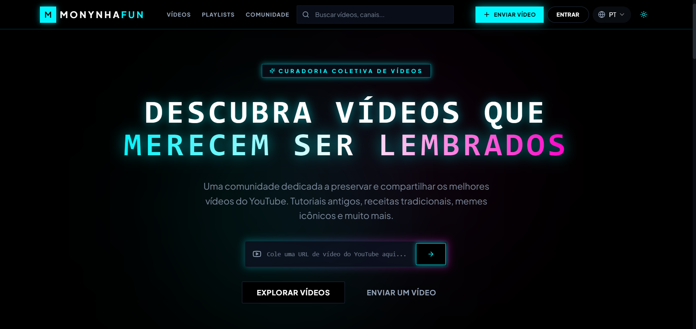
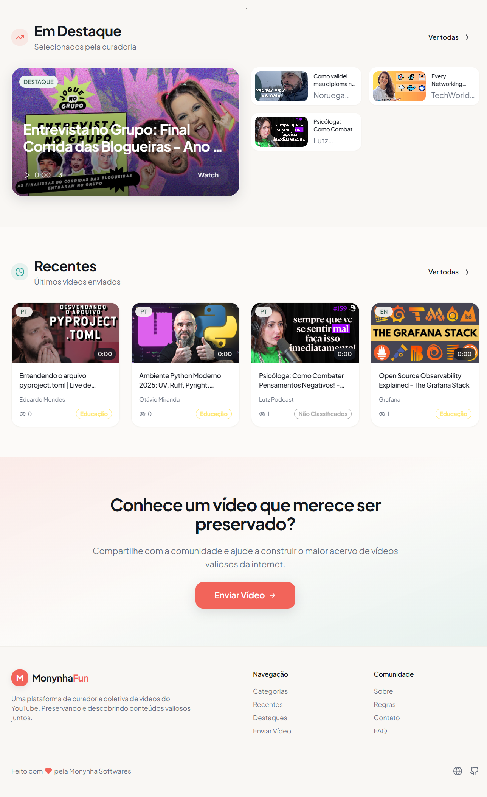
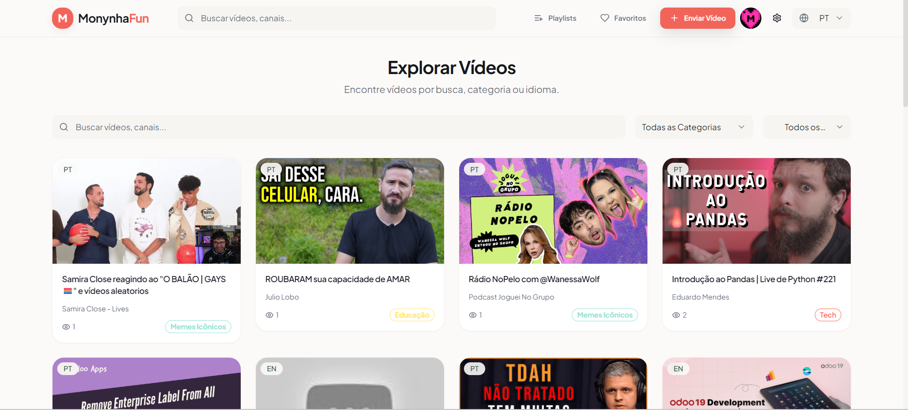
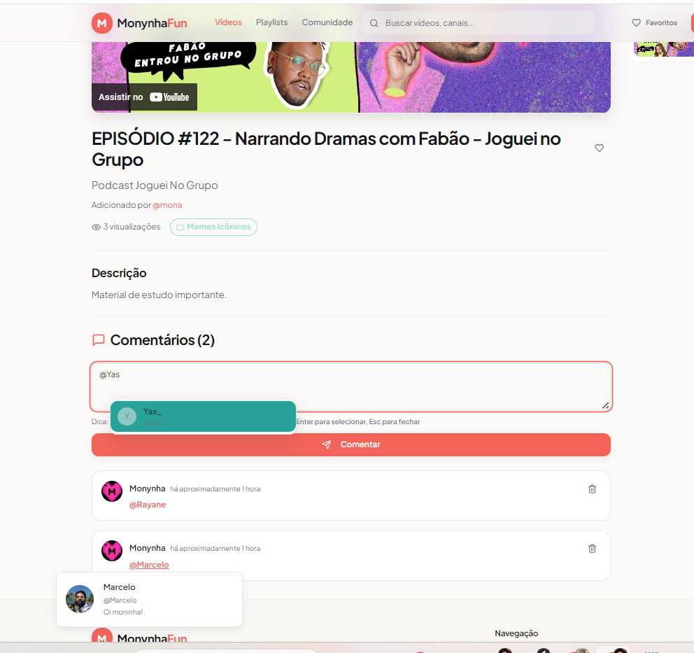

# Monynha Fun – Cultural Video Curation Platform 🎬



> *A passion project by **Marcelo Santos**, crafted with care to bring together the best of cultural video content that gets lost in the algorithmic noise. Now with mention autocomplete because Marcelo got tired of copying usernames like it's 2005.*

**🌐 Live Platform**: https://monynha.fun

---

## 💭 What's This All About?

Look, I built Monynha Fun because I was fed up, sabe? Scrolling through YouTube, seeing the same algorithm-driven trash, while *amazing* cultural content just... disappears. So here's the deal:

We're creating a space where **human taste matters**. A place where curators (like you, like me) can say "ey, this video is worth your time" – and mean it. AI helps us out, sure, but **humans are in charge**. No predatory engagement metrics. No dark patterns. Just good content, properly organized.

### The Vision
- 🤝 **People > Algorithms**: Real human expertise, enhanced by AI (not replaced by it)
- 🌍 **Cultural Preservation**: Keeping the gems that YouTube's algorithm would bury
- 📚 **Community-Driven**: Every curator brings their taste, their knowledge, their soul
- 🎓 **Learning Through Playlists**: Organize videos into beautiful learning paths
- 🔓 **Open & Accessible**: Quality content for everyone, no gatekeeping

---

## 📸 See It In Action

### Homepage – Where Magic Happens ✨


Your first impression matters, né? Clean hero section, easy access to what's hot right now, and categories that actually make sense. No fluff.

### Discover Videos 🔍


Browse through categories that real people organized. Search, filter, read about *why* someone added a video. Simple as that.

### Create Playlists Like You Own The Place 📋


Build learning paths. Curate collections. Share with friends or the whole community. Your taste, your rules. You can even invite collaborators to help build something together.

### Comments & Community Interaction 💬


Every video deserves thoughtful discussion. Leave comments, reply to curators, share why a video matters to you. Build real conversations around content that resonates.

**✨ NEW**: Type `@` and watch the magic happen – autocomplete dropdown with user avatars, keyboard navigation (↑↓ to browse, Enter to select), and 300ms debouncing because we're not savages who spam the database. Works on mobile too. 📱

**🌍 Public Comments**: Everyone can read comments now – even anonymous lurkers. Good discussions deserve an audience. (Don't worry, only logged-in folks can post. We're not *that* crazy.)

No algorithms deciding what's visible – comments stay honest and community-driven. Tag people with `@username` and actually see their face pop up. Because UX matters, viu?

### Your Profile 👤


Show the world what you're passionate about. Add a bio, customize your presence. People will see the videos *you* curated. Be proud of that.

---

## 🛠 The Tech Behind It All

I chose a stack that's modern, scalable, and – honestly – a joy to work with. No bloat, no unnecessary complexity.

### Frontend Magic ✨
- **React.js** + **TypeScript** – Because bugs are embarrassing
- **Vite** – Lightning-fast builds and dev server. Makes coding pleasant
- **Tailwind CSS** – Utility-first styling without CSS headaches
- **shadcn/ui** – Beautiful components that just work
- **React Router DOM** – Smooth navigation experience

### State & Data Management 🧠
- **TanStack Query** – Smart caching and server state (no data soup)
- **React Hook Form** – Forms that don't suck
- **Zod** – Type-safe validation from day one

### Backend Backbone 🔧
- **Supabase** – PostgreSQL, Auth, and Edge Functions in one place
- **Supabase RLS** – Row-level security, properly implemented
- **Edge Functions** – AI enrichment and smart automations

### UX Polish 🎨
- **Lucide React** – Clean icons
- **Sonner** – Toast notifications that don-t annoy
- **date-fns** – Dates done right
- **i18next** – Portuguese, English, and more

### Code Quality & CI/CD 🔧
- **ESLint** + **TypeScript** – Catch errors before they happen
- **Vitest** – Fast, modern testing framework
- **GitHub Actions** – Automated CI with intelligent caching
- **Feature-Sliced Design** – Organized by domain (entities, features, shared)

---

## 🎯 What Can You Do Here?

### 🔍 Discover Videos
Browse intelligently organized content. Search, filter by category, see what real curators think about each video. No dark patterns, just honest recommendations.

### 📋 Build Playlists
Create learning paths, collections, whatever makes sense to you. Share with the community or keep it personal. Invite friends to collaborate – yeah, we support that.

### 👥 User System
Sign up securely. Create a profile that represents *you*. Show everyone your curated taste. Your contribution matters here.

### ⭐ Save Favorites
Keep track of videos that hit different. Your personal collection grows with you.

### 🌍 Community
See who else is curating. Check out their playlists. Learn from other people's taste. Share knowledge.

### 📹 Submit Content
Found an amazing video the world should see? Add it to Monynha Fun. Our AI will help enrich it with metadata.

### 🌐 Multi-Language
Portuguese, English, Spanish, French – we're building for everyone. More languages coming.

### 💬 Smart Mentions
Tag users in comments with autocomplete that actually works. Type `@` and boom – dropdown with avatars, display names, and keyboard navigation. No more copying usernames like a caveman. Fully internationalized in 4 languages because we're fancy like that. ✨

---

## 🚀 Getting Started (It's Easy, I Promise)

### Set It Up Locally

```bash
# Clone the repo
git clone https://github.com/Monynha-Softwares/video-vault

# Go into the folder
cd monynha-fun

# Install dependencies
npm i
# or if you're pnpm gang:
pnpm install

# Fire it up!
npm run dev
```

Open **http://localhost:5173** and boom – you're in.

### Environment Setup

Create a `.env.local` file (ask Marcelo for the keys, or set up your own Supabase project):

```env
VITE_SUPABASE_URL=your_supabase_url_here
VITE_SUPABASE_PUBLISHABLE_KEY=your_anon_key_here
```

---

## 📁 How The Code Is Organized

The structure is clean and logical – I hate messy codebases:

```
src/
├── components/              # Reusable UI pieces
│   ├── ui/                 # shadcn/ui components (don't touch upstream)
│   ├── playlist/           # Playlist-specific components
│   ├── Header.tsx
│   ├── Footer.tsx
│   └── ...
├── pages/                   # Page-level components (one per route)
│   ├── Index.tsx           # Homepage
│   ├── Auth.tsx            # Login/Signup
│   ├── Videos.tsx          # Video browse
│   ├── VideoDetails.tsx    # Single video view
│   ├── Playlists.tsx       # Playlist manager
│   ├── PlaylistDetails.tsx
│   ├── Profile.tsx         # User profiles
│   ├── EditProfile.tsx
│   ├── Favorites.tsx
│   ├── Community.tsx
│   ├── Submit.tsx          # Add videos
│   └── ...more pages
├── features/                # Feature modules (organized by domain)
│   ├── auth/               # Authentication
│   ├── videos/             # Video management
│   ├── playlists/          # Playlist management
│   └── ...
├── entities/                # Domain entities
│   ├── video/              # Video entity & API
│   ├── playlist/           # Playlist entity & API
│   └── ...
├── shared/                  # Shared utilities and hooks
│   ├── hooks/              # Reusable React hooks
│   │   ├── use-mobile.tsx        # Mobile detection
│   │   ├── useVideoViewIncrement.tsx  # Video view tracking
│   │   └── useRequireAuth.tsx    # Authentication guard
│   ├── lib/                # Helper functions
│   │   ├── format.ts       # Data formatting utilities
│   │   └── youtube.ts      # YouTube URL parsing
│   └── test/               # Testing utilities
├── integrations/            # External services
│   └── supabase/           # Supabase client setup
├── lib/                     # Utilities
│   ├── utils.ts            # Helpers (cn, etc)
│   └── youtube.ts          # YouTube URL parsing, oEmbed
├── i18n/                    # Translations
│   ├── config.ts           # i18next setup
│   └── locales/            # PT, EN, etc
├── App.tsx                  # Main app & routes
└── main.tsx                 # Entry point
```

### Custom Hooks

The codebase includes several custom hooks to promote code reuse and maintainability:

#### `useVideoViewIncrement`
Manages video view count increments with optimistic UI updates:
```typescript
const { viewCount, showPlus, handleViewIncrement } = useVideoViewIncrement(initialCount, animationDuration);
```

#### `useRequireAuth`
Authentication guard for protected routes:
```typescript
const { user, loading } = useRequireAuth('/auth');
```

#### `use-mobile`
Detects if the user is on a mobile device:
```typescript
const isMobile = useMobile();
```

Every folder has a purpose. No random files lying around.

---

## � Available Commands

```bash
# Development server with hot reload (what you'll use most)
npm run dev

# Build for production (minified, optimized)
npm run build

# Build with dev settings (if debugging production)
npm run build:dev

# Preview the production build locally
npm run preview

# Run the linter (keep code clean)
npm run lint
```

---

## 🐳 Deploying This Thing

We use Docker to keep everything consistent. Nginx serves the static build.

```bash
# Build the image
docker build -t monynha-fun .

# Run it locally
docker run -p 80:80 monynha-fun
```

Then hit `http://localhost` and you're golden.

### Platforms That Work
- **Coolify** (recommended – simple, clean)
- Any Docker-compatible host (AWS, DigitalOcean, Heroku, whatever)
- Vercel/Netlify (if you prefer that workflow)

Just make sure your Supabase env vars are set. That's it.

---

## 🔐 Making It Work – Environment Variables

You need two things from Supabase:

```env
VITE_SUPABASE_URL=https://your-project.supabase.co
VITE_SUPABASE_ANON_KEY=your_anon_key_here
```

These are public (it's fine, Supabase uses RLS to protect data). Create a `.env.local` file in the root and paste them in.

---

## 🗄️ The Database (Where The Magic Happens)

I designed the database with security and simplicity in mind:

### Core Tables
- **profiles** – User info (name, bio, avatar)
- **videos** – The actual content (title, description, YouTube ID)
- **categories** – Organized tags (Tech, Arts, Education, etc)
- **favorites** – Videos you bookmarked
- **playlists** – Your collections
- **playlist_videos** – Links videos to playlists (with ordering!)
- **ai_enrichments** – AI-generated metadata for each video
- **playlist_collaborators** – Share playlists with friends
- **playlist_progress** – Track watched videos in learning playlists

### Security First 🔒
Every table has Row-Level Security (RLS) enabled. Users can only see/edit their own data. Period.

No data leaks. No shortcuts. We take that seriously.

---

## 🎨 The Design System

### Tailwind CSS
No CSS files. No modules. Just clean utility classes. Responsive by default.

### shadcn/ui Components
High-quality, accessible components. We extend them when needed but don't modify the source (keeps upgrades smooth).

### Icons from Lucide React
Simple, beautiful, consistent. Covers almost everything.

---

## 🌍 Languages & Internationalization

Built with i18next so we can add languages super easily. Right now:
- 🇧🇷 **Portuguese (PT-BR)**
- 🇺🇸 **English (EN-US)**

More languages? Easy. Just ask or add translations to `src/i18n/locales/`.

---

## 🤝 Want to Contribute?

Great! You can work locally or directly on GitHub. Here's how:

### Option 1: Local Development (The Pro Way)
```bash
git clone https://github.com/Monynha-Softwares/video-vault
cd monynha-fun
npm i
npm run dev
```
Make changes, test locally, push to your branch.

### Option 2: GitHub Web Editor (Quick Fixes)
1. Go to a file
2. Click the pencil icon
3. Edit and commit

### Option 3: GitHub Codespaces (If You're Feeling Fancy)
1. Click "Code" → "Codespaces" → "New codespace"
2. Edit directly in the browser
3. Commit and push

---

## 🔗 Custom Domain

Want your own domain? Your deployment platform probably has docs for that. Set DNS records, done.

---

## 📞 More Resources

- **About Page** – Learn what we're really doing here
- **FAQ Page** – Answers to stuff people ask
- **Rules Page** – How to behave (spoiler: just be cool)
- **Contact Page** – Hit me up if you have questions

---

## 📊 What Gets Tracked

- How many videos are curated
- Who's contributing
- View counts (so we can feature the good stuff)
- Category popularity

Nothing creepy. No ads. No surveillance.

---

## 🆘 Running Into Problems?

### Port Already In Use?
```bash
npm run dev -- --port 3000
```

### Dependencies Missing?
```bash
# Clear and reinstall
rm pnpm-lock.yaml
pnpm install
```

### Build Failing?
```bash
# Clear the cache
rm -rf dist
npm run build
```

### Something Else?
Check the [Supabase docs](https://supabase.com/docs) or [Vite docs](https://vitejs.dev). Or just message me (@marcellosantos).

---

## 📝 About This Project

**Built by**: Marcelo Santos  
**Organization**: Monynha Softwares  
**License**: Check the LICENSE file  
**Version**: 0.0.0 (and growing!)

---

## 🌟 What's Next?

We're constantly improving. On the roadmap:
- Real AI integration (actual enrichment, not simulated)
- Video search with full-text indexing
- Smart recommendations
- Community comments & ratings
- Better mobile experience
- Maybe a mobile app someday

---

## 🎉 Get Involved

- 📹 **Submit videos** – Share the good stuff
- 📋 **Create playlists** – Build learning paths
- 🐛 **Report bugs** – Help us improve
- 💡 **Suggest features** – What's missing?
- 🤝 **Spread the word** – Tell your friends

---

**Visit us at**: https://monynha.com  
**Made with** ☕ **and** 💡 **by Marcelo Santos**