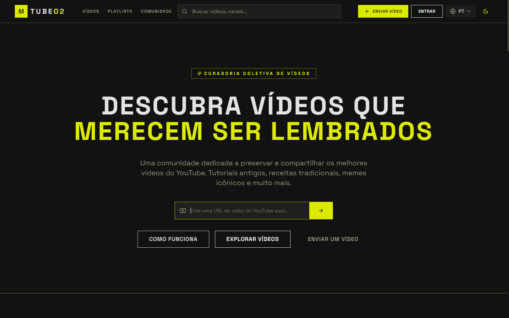
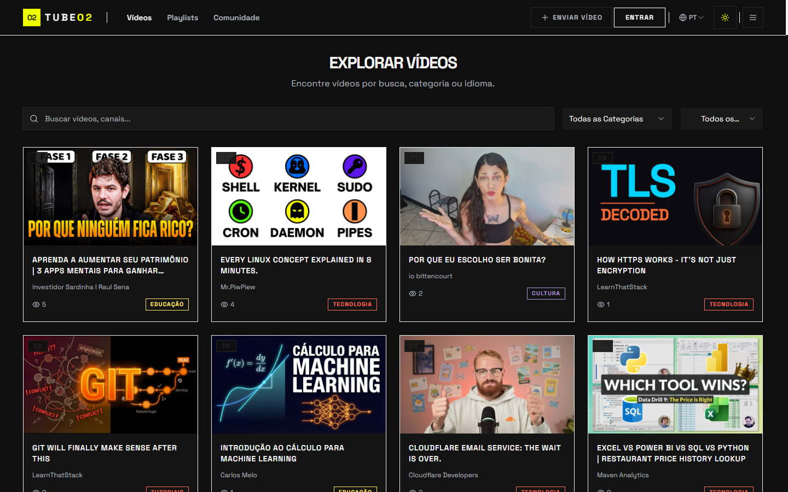
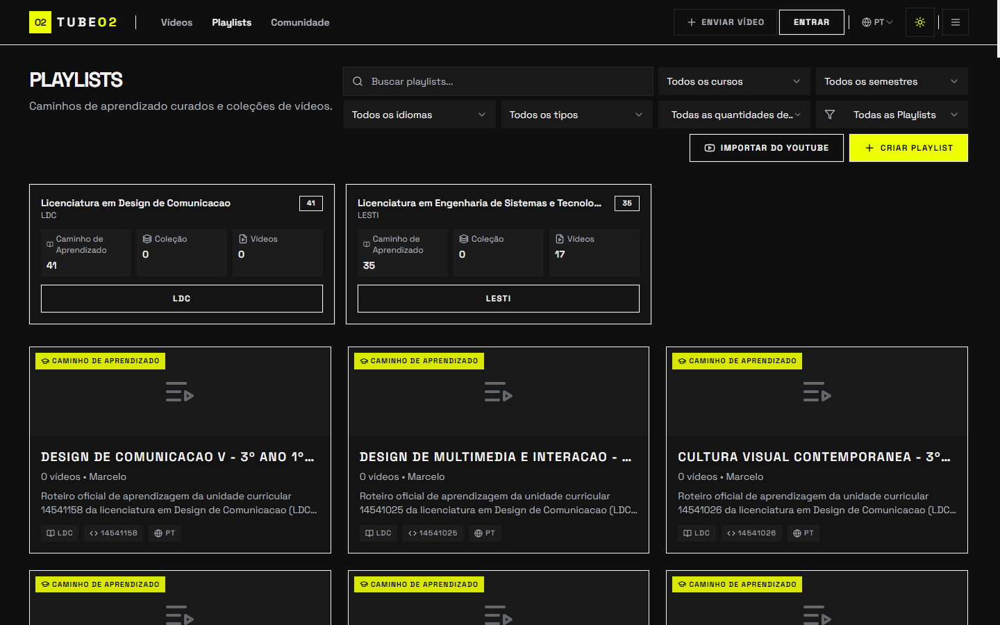
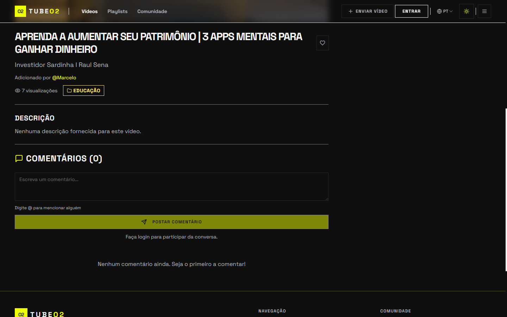
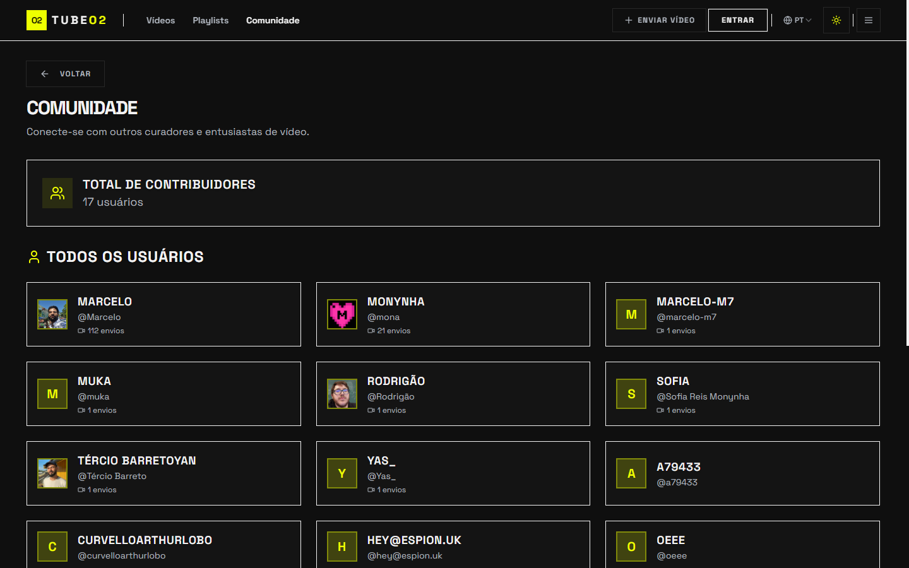

# Tube O2 – Cultural Video Curation Platform 🎬




> *A passion project by **Marcelo Santos**, crafted with care to bring together the best of cultural video content that gets lost in the algorithmic noise. Now with mention autocomplete because Marcelo got tired of copying usernames like it's 2005.*

**🌐 Live Platform**: https://tube.open2.tech

---

## 💭 What's This All About?

Look, I built Tube O2 because I was fed up, sabe? Scrolling through YouTube, seeing the same algorithm-driven trash, while *amazing* cultural content just... disappears. So here's the deal:

We're creating a space where **human taste matters**. A place where curators (like you, like me) can say "ey, this video is worth your time" – and mean it. AI helps us out, sure, but **humans are in charge**. No predatory engagement metrics. No dark patterns. Just good content, properly organized.

### The Vision
- 🤝 **People > Algorithms**: Real human expertise, enhanced by AI (not replaced by it)
- 🌍 **Cultural Preservation**: Keeping the gems that YouTube's algorithm would bury
- 📚 **Community-Driven**: Every curator brings their taste, their knowledge, their soul
- 🎓 **Learning Through Playlists**: Organize videos into beautiful learning paths
- 🔓 **Open & Accessible**: Quality content for everyone, no gatekeeping

---

## 📌 Documentation & Instructions (Updated June 6, 2026)

To keep onboarding and AI-assisted edits consistent, treat these as the primary references:

- Project guide: [`README.md`](README.md)
- Architecture and boundaries: [`docs/CODEBASE.md`](docs/CODEBASE.md)
- Team/agent rules: [`AGENTS.md`](AGENTS.md) and [`AI_RULES.md`](AI_RULES.md)
- Frontend instruction profile: [`.github/instructions/frontend.instructions.md`](.github/instructions/frontend.instructions.md)
- Supabase/backend instruction profile: [`.github/instructions/backend.instructions.md`](.github/instructions/backend.instructions.md)
- Supabase hosted config and Auth email templates: [`supabase/config.toml`](supabase/config.toml) and [`supabase/email-templates/`](supabase/email-templates/)
- i18n consistency rules: [`.github/instructions/i18n.instructions.md`](.github/instructions/i18n.instructions.md)
- Testing rules: [`.github/instructions/testing.instructions.md`](.github/instructions/testing.instructions.md)

> Note: when guidance conflicts, follow `AGENTS.md` + `.github/instructions/*` first, then use older historical notes as context.

---

## 📸 See It In Action

### Homepage – Where Magic Happens ✨


Your first impression matters, né? Clean hero section, easy access to what's hot right now, and categories that actually make sense. No fluff.

### Discover Videos 🔍


Browse through categories that real people organized. Search, filter, read about *why* someone added a video. Simple as that.

### Create Playlists Like You Own The Place 📋


Build learning paths. Curate collections. Share with friends or the whole community. Your taste, your rules. You can even invite collaborators to help build something together.

**✨ NEW**: Course-focused filtering with active removable chips, semester/language/type/video-range filters, URL-persisted state, and summary cards per course for quick drill-in.

### Comments & Community Interaction 💬


Every video deserves thoughtful discussion. Leave comments, reply to curators, share why a video matters to you. Build real conversations around content that resonates.

**✨ NEW**: Type `@` and watch the magic happen – autocomplete dropdown with user avatars, keyboard navigation (↑↓ to browse, Enter to select), and 300ms debouncing because we're not savages who spam the database. Works on mobile too. 📱

**🌍 Public Comments**: Everyone can read comments now – even anonymous lurkers. Good discussions deserve an audience. (Don't worry, only logged-in folks can post. We're not *that* crazy.)

No algorithms deciding what's visible – comments stay honest and community-driven. Tag people with `@username` and actually see their face pop up. Because UX matters, viu?

### Your Profile 👤


Show the world what you're passionate about. Add a bio, customize your presence. People will see the videos *you* curated. Be proud of that.

---

## 🛠 The Tech Behind It All

I chose a stack that's modern, scalable, and – honestly – a joy to work with. No bloat, no unnecessary complexity.

### Frontend Magic ✨
- **React.js** + **TypeScript** – Because bugs are embarrassing
- **Vite** – Lightning-fast builds and dev server. Makes coding pleasant
- **Tailwind CSS** – Utility-first styling without CSS headaches
- **shadcn/ui** – Beautiful components that just work
- **React Router DOM** – Smooth navigation experience

### State & Data Management 🧠
- **TanStack Query** – Smart caching and server state (no data soup)
- **React Hook Form** – Forms that don't suck
- **Zod** – Type-safe validation from day one

### Backend Backbone 🔧
- **Supabase** – PostgreSQL, Auth, and Edge Functions in one place
- **Supabase RLS** – Row-level security, properly implemented
- **Edge Functions** – AI enrichment and smart automations
- **Bun runtime server** – Serves production `dist/` and injects dynamic OG/Twitter tags for video pages

### UX Polish 🎨
- **Lucide React** – Clean icons
- **Sonner** – Toast notifications that don't annoy
- **date-fns** – Dates done right
- **i18next** – Portuguese, English, and more

### Code Quality & CI/CD 🔧
- **ESLint** + **TypeScript** – Catch errors before they happen
- **Vitest** – Fast, modern testing framework
- **GitHub Actions** – Automated CI with intelligent caching
- **Feature-Sliced Design** – Organized by domain (entities, features, shared)

---

## 🎯 What Can You Do Here?

### 🔍 Discover Videos
Browse intelligently organized content. Search, filter by category, see what real curators think about each video. No dark patterns, just honest recommendations.

### 📋 Build Playlists
Create learning paths, collections, whatever makes sense to you. Share with the community or keep it personal. Invite friends to collaborate – yeah, we support that.

### ▶️ Import YouTube Playlists
Paste a public YouTube playlist URL and Tube O2 queues the videos through Supabase Edge Functions. Existing enriched videos are skipped, recently queued videos are reused, and new submissions flow through the same async enrichment/status pipeline as manual submissions.

### 👥 User System
Sign up securely. Create a profile that represents *you*. Show everyone your curated taste. Your contribution matters here.

### ⭐ Save Favorites
Keep track of videos that hit different. Your personal collection grows with you.

### 🌍 Community
See who else is curating. Check out their playlists. Learn from other people's taste. Share knowledge.

### 📹 Submit Content
Found an amazing video the world should see? Add it to Tube O2. Our AI will help enrich it with metadata.

### 🌐 Multi-Language
Portuguese, English, Spanish, French – we're building for everyone. More languages coming.

### 💬 Smart Mentions
Tag users in comments with autocomplete that actually works. Type `@` and boom – dropdown with avatars, display names, and keyboard navigation. No more copying usernames like a caveman. Fully internationalized in 4 languages because we're fancy like that. ✨

---

## 🚀 Getting Started (It's Easy, I Promise)

### Set It Up Locally

```bash
# Clone the repo
git clone https://github.com/marcelo-m7/monynha.fun

# Go into the folder
cd monynha.fun

# Install dependencies
pnpm install
# or if you prefer npm:
npm install

# Fire it up!
pnpm dev
```

Open **http://localhost:8080** and boom – you're in.

### Environment Setup

Create a `.env` or `.env.local` file (ask Marcelo for the keys, or set up your own Supabase project):

```env
VITE_SUPABASE_URL=your_supabase_url_here
VITE_SUPABASE_PUBLISHABLE_KEY=your_publishable_key_here
```

Server-only values such as `SUPABASE_SERVICE_ROLE_KEY`, `OPENAI_API_KEY`, `GEMINI_API_KEY`, and `RESEND_API_KEY` belong in Supabase secrets or runtime server env, not in client-exposed `VITE_*` variables. See [`.env.example`](.env.example) for the full local template.

---

## 📁 How The Code Is Organized

The structure is clean and logical – I hate messy codebases:

```
src/
├── app/providers/           # Global providers (QueryClient, Auth, i18n, theme, Helmet, toasts)
├── components/              # Reusable UI by domain
│   ├── ui/                  # shadcn/ui primitives
│   ├── layout/              # Header, Footer, hero/category layout
│   ├── playlist/            # Playlist UI, including YouTube import dialog
│   ├── comment/             # Comment forms, mentions, display
│   ├── video/               # Video cards and video-specific UI
│   └── ...
├── pages/                   # Lazy route-level pages registered in App.tsx
├── features/                # Feature orchestration hooks and mutations
│   ├── videos/
│   ├── playlists/
│   ├── video-submissions/
│   ├── editor-applications/
│   └── ...
├── entities/                # Domain API, types, and query-key factories
│   ├── video/
│   ├── playlist/
│   ├── video_submission/
│   └── ...
├── shared/                  # Cross-domain hooks, API clients, validation, tests
│   ├── api/supabase/        # Shared Supabase client + Edge Function wrapper
│   ├── hooks/               # Reusable React hooks
│   ├── lib/                 # validation, format, youtube, slug, image
│   └── test/                # Vitest/MSW utilities
├── integrations/supabase/   # Generated Supabase client/types
├── lib/utils.ts             # shadcn cn() helper only
├── i18n/locales/            # PT, EN, ES, FR locale resources
├── App.tsx                  # Lazy routes
└── main.tsx                 # Entry point

supabase/
├── config.toml              # Hosted Supabase config, including Auth email template deployment
├── email-templates/         # Supabase Auth email templates: invite, confirmation, recovery, email change
├── functions/               # Edge Functions: enrich-video, import-youtube-playlist, email flows
├── functions/_shared/       # Shared Deno helpers and enrichment clients
└── migrations/              # Postgres schema, RLS, functions, and data fixes

server/
└── server.ts                # Bun runtime server for static assets + dynamic social metadata
```

### Custom Hooks

The codebase includes several custom hooks to promote code reuse and maintainability:

#### `useVideoViewIncrement`
Manages video view count increments with optimistic UI updates:
```typescript
const { viewCount, showPlus, handleViewIncrement } = useVideoViewIncrement(initialCount, animationDuration);
```

#### `useRequireAuth`
Authentication guard for protected routes:
```typescript
const { user, loading } = useRequireAuth('/auth');
```

#### `use-mobile`
Detects if the user is on a mobile device:
```typescript
const isMobile = useMobile();
```

Every folder has a purpose. No random files lying around.

---

## 📜 Available Commands

```bash
# Development server with hot reload (what you'll use most)
pnpm dev

# Build for production (minified, optimized)
pnpm build

# Build with dev settings (if debugging production)
pnpm build:dev

# Preview the production build locally
pnpm preview

# Run the linter (keep code clean)
pnpm lint

# Type-check the project
pnpm typecheck

# Run tests (one-off)
pnpm test

# Run tests in watch mode
pnpm test:watch

# Run tests with coverage
pnpm test:coverage

# Run Playwright E2E tests
pnpm test:e2e

# Generate bundle analysis report
pnpm build:analyze
```

---

## 🐳 Deploying This Thing

We use Docker to keep everything consistent. Production now uses a **Bun runtime server** that serves `dist/` and injects dynamic OG/Twitter tags for `/videos/:id` in the initial HTML.

```bash
# Build the image
docker build -t tube-o2 .

# Run it locally (runtime Supabase vars required for dynamic OG tags)
docker run -p 80:80 \
	-e SUPABASE_URL=https://your-project.supabase.co \
	-e SUPABASE_ANON_KEY=your_anon_key \
	tube-o2
```

Then hit `http://localhost` and you're golden.

### Platforms That Work
- **Coolify** (recommended – simple, clean)
- Any Docker-compatible host (AWS, DigitalOcean, Heroku, whatever)
- Vercel/Netlify (if you prefer that workflow)

Just make sure your Supabase env vars are set. That's it.

---

## 🔐 Making It Work – Environment Variables

There are two env-var groups now:

### Build-time (Vite)

```env
VITE_SUPABASE_URL=https://your-project.supabase.co
VITE_SUPABASE_PUBLISHABLE_KEY=your_publishable_key_here
```

These are embedded during `vite build`.

### Runtime (Bun server)

```env
SUPABASE_URL=https://your-project.supabase.co
SUPABASE_ANON_KEY=your_anon_key_here
```

These are used by `server/server.ts` at request time to fetch video metadata and inject OG/Twitter tags for `/videos/:id` before JS runs.

`VITE_*` vars are build-time. `SUPABASE_*` vars are runtime.

---

## ⚙️ Supabase Backend & Edge Functions

There is no active `backend/` FastAPI service in this repository. The backend surface is:

- **Postgres + RLS** in Supabase, versioned through `supabase/migrations/`
- **Edge Functions** in `supabase/functions/`
- **Bun runtime server** in `server/server.ts` for production static serving and dynamic social metadata

### Edge Functions

Supabase project ref: `wvkjainfwsyiyfcmbtid`.

| Function | Purpose |
|---|---|
| `enrich-video` | Enriches video metadata, updates `video_submissions`, and assigns eligible playlists |
| `import-youtube-playlist` | Reads a public YouTube playlist, upserts missing video shells, and queues pending submissions |
| `mark-top-featured` | Marks top videos as featured based on database logic |
| `send-contact-message` | Stores contact messages and sends transactional email |
| `send-editor-application-confirmation` | Sends editor-application confirmation email |

Frontend code invokes Edge Functions through [`src/shared/api/supabase/edgeFunctions.ts`](src/shared/api/supabase/edgeFunctions.ts). Do not call `supabase.functions.invoke` directly in components or feature hooks.

User-triggered functions should keep JWT verification enabled, use shared CORS/JSON helpers from [`supabase/functions/_shared/http.ts`](supabase/functions/_shared/http.ts), and apply shared rate limiting before expensive work. Avoid wildcard CORS on deployed functions unless an endpoint is intentionally public and unauthenticated.

### Hosted Supabase Config & Auth Email Templates

Hosted Supabase project settings that must be reproducible live in [`supabase/config.toml`](supabase/config.toml). Auth email HTML lives in [`supabase/email-templates/`](supabase/email-templates/):

- `invite.html`
- `confirm-signup.html`
- `recovery.html`
- `email-change.html`

Deploy config changes from this repository root:

```bash
pnpx supabase config push --project-ref wvkjainfwsyiyfcmbtid
```

Do not use `--yes` for config pushes. The CLI may propose changes to production API/Auth/Storage settings when local config drifts; inspect prompts and accept only the intended diff. A successful verification should report API, DB, Auth, and Storage config as up to date.

### Async Submission Pipeline

Manual submissions and YouTube playlist imports both flow through `public.video_submissions`:

1. The frontend creates or receives a `video_submissions.id`.
2. `/submit/status/:submissionId` reads status by submission id.
3. `enrich-video` moves submissions through `pending`, `processing`, `success`, `failed`, `duplicate`, or `recoverable_error`.
4. Playlist assignment metadata is stored in the submission/enrichment flow for education/course playlists.

The local contract is documented in [`docs/features/supabase-db-02-03-04.md`](docs/features/supabase-db-02-03-04.md).

### YouTube Playlist Import

[`PlaylistImportDialog`](src/components/playlist/PlaylistImportDialog.tsx) accepts a public YouTube playlist URL and sends this payload to `import-youtube-playlist`:

```json
{
  "playlist_url": "https://www.youtube.com/playlist?list=...",
  "language": "und",
  "max_videos": 200
}
```

The Edge Function returns counts plus new queued submissions. The dialog sends users to `/playlists/import/progress`, where the batch is tracked, pending submissions are sent to `enrich-video` with a small concurrency limit, and already enriched or recently queued videos are skipped/reused.

### Local Edge Function Work

Use the Supabase CLI and discover flags with help before assuming them:

```bash
supabase --help
supabase functions --help
supabase functions serve import-youtube-playlist --env-file .env
```

Server-only values such as `SUPABASE_SERVICE_ROLE_KEY`, `OPENAI_API_KEY`, `GEMINI_API_KEY`, and `RESEND_API_KEY` should be configured as Supabase secrets for deployed Edge Functions.

---

## 🗄️ The Database (Where The Magic Happens)

I designed the database with security and simplicity in mind:

### Core Tables
- **profiles** – User info (name, bio, avatar)
- **videos** – The actual content (title, description, YouTube ID)
- **categories** – Organized tags (Tech, Arts, Education, etc)
- **favorites** – Videos you bookmarked
- **playlists** – Your collections
- **playlist_videos** – Links videos to playlists (with ordering!)
- **ai_enrichments** – AI-generated metadata for each video
- **video_submissions** – Async submission/import status tracking
- **playlist_collaborators** – Share playlists with friends
- **playlist_progress** – Track watched videos in learning playlists
- **playlist_follows** – Follow public playlists
- **editor_applications** – Editorial access requests
- **contact_messages** – Contact form messages and delivery tracking
- **direct_messages** – Private messages through secure RPCs and RLS-compatible reads
- **edge_rate_limits** – Server-side rate limiting for user-triggered Edge Functions

### Security First 🔒
Every table has Row-Level Security (RLS) enabled. Users can only see/edit their own data. Period.

No data leaks. No shortcuts. We take that seriously.

---

## 🎨 The Design System

### Tailwind CSS
No CSS files. No modules. Just clean utility classes. Responsive by default.

### shadcn/ui Components
High-quality, accessible components. We extend them when needed but don't modify the source (keeps upgrades smooth).

### Icons from Lucide React
Simple, beautiful, consistent. Covers almost everything.

---

## 🌍 Languages & Internationalization

Built with i18next so we can add languages super easily. Right now:
- 🇧🇷 **Portuguese (PT-BR)**
- 🇺🇸 **English (EN-US)**
- 🇪🇸 **Spanish (ES)**
- 🇫🇷 **French (FR)**

Locale files must stay aligned across `src/i18n/locales`.

---

## 🤝 Want to Contribute?

Great! You can work locally or directly on GitHub. Here's how:

### Option 1: Local Development (The Pro Way)
```bash
git clone https://github.com/marcelo-m7/tube-o2
cd tube-o2
pnpm install
pnpm dev
```
Make changes, test locally, push to your branch.

### Option 2: GitHub Web Editor (Quick Fixes)
1. Go to a file
2. Click the pencil icon
3. Edit and commit

### Option 3: GitHub Codespaces (If You're Feeling Fancy)
1. Click "Code" → "Codespaces" → "New codespace"
2. Edit directly in the browser
3. Commit and push

---

## 🔗 Custom Domain

Want your own domain? Your deployment platform probably has docs for that. Set DNS records, done.

---

## 📞 More Resources

- **About Page** – Learn what we're really doing here
- **FAQ Page** – Answers to stuff people ask
- **Rules Page** – How to behave (spoiler: just be cool)
- **Contact Page** – Hit me up if you have questions

---

## 📊 What Gets Tracked

- How many videos are curated
- Who's contributing
- View counts (so we can feature the good stuff)
- Category popularity

Nothing creepy. No ads. No surveillance.

---

## 🆘 Running Into Problems?

### Port Already In Use?
```bash
pnpm dev -- --port 3000
```

### Dependencies Missing?
```bash
# Clear and reinstall
rm pnpm-lock.yaml
pnpm install
```

### Build Failing?
```bash
# Clear the cache
rm -rf dist
pnpm build
```

### Something Else?
Check the [Supabase docs](https://supabase.com/docs) or [Vite docs](https://vitejs.dev). Or just message me (@marcellosantos).

---

## 📝 About This Project

**Built by**: Marcelo Santos  
**Organization**: Open 2 Technology  
**License**: Check the LICENSE file  
**Version**: 0.1.5 (and growing!)

---

## 🌟 What's Next?

We're constantly improving. On the roadmap:
- Batch AI enrichment for existing videos
- Video search with full-text indexing
- Smart recommendations
- Better mobile experience
- Maybe a mobile app someday

---

## 🎉 Get Involved

- 📹 **Submit videos** – Share the good stuff
- 📋 **Create playlists** – Build learning paths
- 🐛 **Report bugs** – Help us improve
- 💡 **Suggest features** – What's missing?
- 🤝 **Spread the word** – Tell your friends

---

**Visit us at**: https://open2.tech  
**Made with** ☕ **and** 💡 **by Marcelo Santos**
